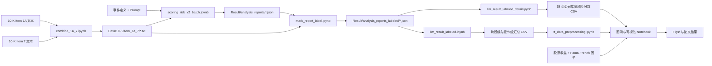

# DNA：Dual Narrative Analysis for 10-K Annual Reports

本仓库是论文 **“Two Sides of the Same Coin: How LLMs Reveal Dual Narratives in Annual Reports”** 的研究代码、数据、中间结果与投稿材料集合。项目使用大语言模型分析 S&P 500 公司 2021–2024 年 Form 10-K 中的两个章节：

- **Item 1A（Risk Factors）**：度量公司披露的事件负面影响，形成 **Impact Score**。
- **Item 7（MD&A）**：度量管理层的应对、缓释与行动叙事，形成 **Response Score**。负分代表缓释/应对叙事更强，正分代表负面影响仍占主导。

LLM 对每条证据生成可审计的 micro-scorecard（加剧因素为正分，缓释因素为负分），随后将证据定位回 Item 1A 或 Item 7，聚合为公司—年度分数，并用于行业分析和投资组合回测。

> 当前仓库是“研究快照”，不是已经封装好的软件包：主要逻辑分散在 Notebook 单元格中，没有统一命令行入口、锁定的依赖文件或自动化测试。README 后半部分列出了已确认的复现断点。

## 核心研究流程



### 推荐运行顺序（主线）

1. **准备 10-K 分章节文本**
   - 原始 Item 1A 与 Item 7 没有完整保存在仓库中；`combine_1a_7.ipynb` 当前从外置磁盘 `/Volumes/ACASIS/...` 读取。
   - 合并后的 1,728 份文本已经位于 `Data/10-K/item_1a_7/`，因此复现实验时可直接从下一步开始。
2. **运行 LLM 批量评分**
   - 入口：`scoring_risk_v2_batch.ipynb`。
   - 输入：合并文本、`Data/LLM/risk_events_COVID.json`、`Data/LLM/prompt_template_v5.txt`、`.env` 中的 `OPENAI_API_KEY`。
   - 模型：Notebook 中写死为 `o3`，JSON 输出；默认 `ThreadPoolExecutor(max_workers=50)`。
   - 输出：`Result/analysis_reports/{ticker}_{filing_date}_{event}.json`。
3. **把证据定位回 10-K 章节**
   - 入口：`mark_report_label.ipynb`。
   - 通过文本规范化与 RapidFuzz 相似度，将每条 evidence 标为 `item_1a`、`item_7` 或二者皆有。
   - 输出：`Result/analysis_reports_labeled/*.json`。
4. **生成结构化评分表**
   - `llm_result_labeled.ipynb`：生成证据级、章节级表。
   - `llm_result_labeled_detail.ipynb`：分别对 `total`、`item_1a`、`item_7` 使用 `sum/max/min/mean/std` 聚合，共生成 15 份 `Data/Fama_French/risk_scores_*.csv`。
5. **准备市场数据**
   - `ff_data_preprocessing.ipynb` 将片段评分整理为公司年度分数，并从 `Data/price_cache.pkl` 构造 `stock_daily_data.csv`。
   - `ff_factors.csv` 已在仓库中，字段为 `date,MKT-RF,SMB,HML,RF`。
6. **分析与回测**
   - 风险分组/Fama–French：`ff_analysis.ipynb` 或批量版 `ff_analysis_batch.ipynb`。
   - 论文主策略：`ff_strategy_4_dim.ipynb`，依据 Item 7 Response Score 构建 “With Response / Without Response” 组合，并用 Item 1A 分数辅助区分风险暴露。
   - 最终作图：`figure_risk_score.ipynb` 与 `result_table_risk_construction.ipynb`。

## 辅助研究流程：GPR 峰值与新闻主题

这是用于从地缘政治风险（GPR）时间序列发现事件/主题的探索分支，不是当前 COVID 主实验的必需步骤。

```text
Data/data_gpr_daily_recent.xlsx
  -> sample_gpr_statistic.ipynb
  -> Data/target_gpr_date.xlsx
  -> sample_news_extract.ipynb + Data/all_news_1984_2024.parquet
  -> Data/news_date_-1_1.parquet
  -> sample_topic_extract.ipynb / peak_topic_analysis*.ipynb

Data/gpr_daily.csv
  -> gpr_peak_select.ipynb
  -> Result/GPR_Peaks/data/gpr_peaks_{year}.csv
  -> peak_topic_analysis*.ipynb
```

## 环境

如需运行代码，请按约定使用名为 `dna` 的 conda 环境：

```bash
conda create -n dna python=3.11 -y
conda activate dna
pip install jupyter pandas numpy scipy scikit-learn statsmodels \
  matplotlib seaborn openpyxl pyarrow tqdm python-dotenv pydantic \
  openai langchain langchain-openai rapidfuzz tiktoken brokenaxes \
  bertopic sentence-transformers hdbscan
```

以上依赖由 Notebook 的 import 静态推断，仓库目前没有 `requirements.txt` 或 `environment.yml`，所以这不是原实验的精确锁定环境。LangChain 与 Pydantic API 在不同 Notebook 中混用了新旧写法，真正复现时建议先固定兼容版本并生成环境锁文件。

运行 LLM 流程前，在根目录 `.env` 中配置：

```text
OPENAI_API_KEY=...
```

不要将真实密钥提交到版本控制。

## 文件与目录说明

### 根目录 Notebook

| 文件 | 作用 | 流程角色 |
|---|---|---|
| `combine_1a_7.ipynb` | 按同一 ticker 和 filing date 合并 Item 1A、Item 7 文本，并插入章节标题。 | 主线预处理；依赖外置磁盘原文 |
| `scoring_risk_v2_batch.ipynb` | 使用 o3、v5 prompt 和 COVID 事件定义并发处理全部合并 10-K；已存在输出会跳过。 | **主 LLM 批处理入口** |
| `mark_report_label.ipynb` | 将 LLM evidence 与原文两个章节做模糊匹配，添加 `item_label`。 | 主线章节标注 |
| `llm_result_labeled.ipynb` | 展开已标注 JSON，输出 evidence 级评分和章节汇总统计。 | 主线结果整理 |
| `llm_result_labeled_detail.ipynb` | 形成 `total/item_1a/item_7 × sum/max/min/mean/std` 的年度公司分数。 | 主线因子构造 |
| `ff_data_preprocessing.ipynb` | 从片段统计生成基础风险分数；从价格缓存提取日收益。 | 主线市场数据整理 |
| `ff_analysis.ipynb` | 按年度风险分数分组，计算累计收益、年化收益/波动/Sharpe，并做 Fama–French 回归。 | 单次回测分析 |
| `ff_analysis_batch.ipynb` | 批量测试不同 item、聚合函数和分组数，收集多空组合 alpha 的 t 值。 | 稳健性/参数搜索 |
| `ff_strategy_2_dim.ipynb` | 使用 Item 1A 与 Item 7 的二维信号比较有行动与无行动组合。 | 策略实验分支 |
| `ff_strategy_4_dim.ipynb` | 综合 Item 1A/7 的 sum/min 信号识别响应状态，构建年度等权组合并回测。 | **论文组合策略主版本** |
| `ff_strategy_4_dim copy.ipynb` | 4D 策略的早期/副本版本，主要使用 sum 分数。 | 历史实验；会写同名图片 |
| `ff_strategy_4_dim copy 2.ipynb` | 4D 策略另一副本，主要使用 mean 分数。 | 历史实验；会写同名图片 |
| `ff_risk_analysis.ipynb` | 合并风险分数和 GICS 行业信息，绘制年度行业分布、趋势、综合版面。 | 早期可视化合集 |
| `ff_risk_analysis_violin.ipynb` | 绘制年度风险分数 raincloud/violin 趋势图。 | 早期作图版本 |
| `ff_risk_analysis_violin_sub.ipynb` | violin 图的子版本/版式实验。 | 历史作图版本 |
| `figure_risk_score.ipynb` | 生成论文使用的风险年度 violin 图与均值趋势图，使用 broken axis。 | **论文最终作图** |
| `figure_risk_score_dual.ipynb` | 双面板/双叙事风险图版本。 | 后续版式实验 |
| `result_table_risk_construction.ipynb` | 从标注报告统计 Item 1A/7 中响应 evidence 的数量与比例，生成论文图。 | 论文表图 |
| `scoring_risk.ipynb` | 较早的事件风险评分实现；默认引用不存在的 `risk_events.json`。 | 原型 |
| `scoring_risk_v2.ipynb` | 引入 micro-scorecard 的单文档实验；默认引用不存在的 `risk_events_9.json`。 | v2 原型 |
| `scoring_risk_v3.ipynb` | 使用 v6 prompt、8 类事件和 Conversation memory 的实验版本。 | 多事件/对话实验 |
| `scoring_10k.ipynb` | 对单个 `item1a_text.txt` 进行结构化评分的早期 LangChain 原型。 | 原型；输入文件未随仓库提供 |
| `scoring_10k_v2.ipynb` | `scoring_10k` 的另一版 Pydantic/LangChain 实现。 | 原型 |
| `langchain_cot.ipynb` | 演示如何切分 10-K 并通过 LangChain 进行 CoT/结构化解析。 | 方法验证原型 |
| `llm_chain_chat.ipynb` | 最小 OpenAI chat 调用实验。 | API 探索 |
| `llm_result.ipynb` | 展开未标注的原始 JSON，生成总报告与简单 evidence 分数表。 | 早期结果整理 |
| `gpr_peak_select.ipynb` | 使用 `scipy.signal.find_peaks` 按年检测 GPR 峰值并保存图和 CSV。 | GPR 支线 |
| `clean_news.ipynb` | 合并 1984–2024 WSJ 数据，清洗日期/正文并写出 Parquet。 | 新闻支线；原始输入在外置磁盘 |
| `sample_gpr_statistic.ipynb` | 对 GPR 指数做描述统计、阈值/异常日期筛选。 | 新闻/GPR 支线 |
| `sample_news_extract.ipynb` | 抽取 GPR 目标日期前后窗口内的新闻。 | 新闻/GPR 支线 |
| `sample_topic_extract.ipynb` | 对筛选新闻做 BERTopic 建模和 OpenAI topic representation。 | 主题原型 |
| `peak_topic_analysis.ipynb` | 按 GPR 峰值匹配新闻并进行 BERTopic 分析。 | 主题实验 |
| `peak_topic_analysis_JIN.ipynb` | 加入 embedding cosine similarity、年度循环和 Excel/CSV 输出的扩展版。 | 主题实验扩展 |
| `peak_topic_analysis_v2.ipynb` | 更精简的峰值新闻主题与相似度版本。 | 主题实验新版 |
| `tiktoken.ipynb` | 统计外置 10-K Item 1/7 文本 token 数量与成本规模。 | 成本估算 |

### 数据目录 `Data/`

| 路径 | 内容 |
|---|---|
| `Data/10-K/item_1a_7/` | 1,728 份已合并的 10-K Item 1A + Item 7 文本；命名为 `{ticker}_{filing_date}.txt`。这是主流程的文本输入。 |
| `Data/10-K/item_1a_7_error/` | 4 份曾需单独重跑/检查的 BFB 文本。 |
| `Data/LLM/prompt_template.txt` | 第一版整体分析 + evidence severity prompt。 |
| `Data/LLM/prompt_template_v5.txt` | 主批处理所用的 micro-scorecard prompt，含时间衰减和事件发生前得分为 0 等约束。 |
| `Data/LLM/prompt_template_v6.txt` | v5 的后续实验版本，供 `scoring_risk_v3.ipynb` 使用。 |
| `Data/LLM/risk_events_COVID.json` | 主实验唯一事件：COVID-19 Pandemic。 |
| `Data/LLM/risk_events_8.json` | 8 类全球风险事件定义。 |
| `Data/LLM/risk_events_v1.json` | 更早的 18 类事件定义。 |
| `Data/Fama_French/risk_scores.csv` | 基础公司年度总风险分数。 |
| `Data/Fama_French/risk_scores_1a.csv` / `risk_scores_7.csv` | 早期 Item 1A/7 公司年度分数。 |
| `Data/Fama_French/risk_scores_{total,item_1a,item_7}_{sum,max,min,mean,std}.csv` | 15 组最终聚合分数，统一字段为 `year,ticker,risk_score`。 |
| `Data/Fama_French/stock_daily_data.csv` | 个股日收益，字段为 `date,ticker,return`。 |
| `Data/Fama_French/ff_factors.csv` | 日频 Fama–French 三因子与无风险利率。 |
| `Data/S&P500_List_2025.xlsx` | ticker、公司名称和 GICS 行业映射，用于行业图表。 |
| `Data/price_cache.pkl` | 股票价格/收益缓存，是 `ff_data_preprocessing.ipynb` 的上游输入。 |
| `Data/data_gpr_daily_recent.xlsx` | 原始/近期 GPR 数据工作簿。 |
| `Data/gpr_daily.csv` | 日频 GPR 序列，供按年峰值检测。 |
| `Data/target_gpr_date.xlsx` | GPR 异常日期筛选结果。 |
| `Data/all_news_1984_2024.parquet` | 清洗合并后的 1984–2024 新闻语料。 |
| `Data/news_date_-1_1.parquet` | GPR 事件日前后各 1 天的新闻子集。 |

### 结果目录 `Result/`

| 路径 | 内容 |
|---|---|
| `Result/analysis_reports/` | 1,728 份原始 LLM JSON 报告。每个文件是一个列表，包含 `event_info`、`holistic_analysis`、`evidence_list` 与每条 evidence 的 micro-scorecard。 |
| `Result/analysis_reports_labeled/` | 1,728 份加入 `item_label` 的 JSON 报告。 |
| `Result/analysis_reports.zip` / `analysis_reports_labeled.zip` | 上述两个目录的压缩备份。 |
| `Result/llm_result/total_analysis_report.csv` | 公司—报告级整体分析与汇总分。 |
| `Result/llm_result/snippet_score.csv` | 未标注 evidence 的基础长表。 |
| `Result/llm_result/snippet_score_labeled.csv` | 含 Item 1A/7 标签的 evidence 长表。 |
| `Result/llm_result/snippet_score_item_count.csv` | 公司—章节级得分和 snippet 数量/统计量。 |
| `Result/llm_result/snippet_scores_list.csv` | 每个公司报告的 Item 1A、Item 7、total 分数列表。 |
| `Result/GPR_Peaks/data/` | 1985–2024 每年的 GPR 峰值 CSV（40 份）。 |
| `Result/GPR_Peaks/figs/` | 与年度峰值 CSV 对应的诊断图（40 份）。 |
| `Result/News_Peaks/` | 当前为空，预留给新闻峰值结果。 |
| `Result/FF_Result/` | 当前为空，预留给回测批量结果。 |

### 图表、论文和演示材料

| 路径/文件 | 内容 |
|---|---|
| `Figs/` | 论文框架图、风险分布图、行业趋势图、组合累计收益图以及 PDF/PNG/PPTX 版本。这里大多是 Notebook 的最终或近最终输出。 |
| 根目录 `*.png` / `*.pdf` | 作图 Notebook 的较早输出或临时导出，如年度行业风险图、raincloud 图、累计收益图。 |
| `Framework/` | DNA 框架的 draw.io 源文件、SVG 图标/表格和演示稿；带 `2`、`3` 后缀的是设计迭代版本。 |
| `Camera_Ready/icaif25-99/Source/main.tex` | Camera-ready 论文 LaTeX 主文件。 |
| `Camera_Ready/icaif25-99/Source/ref.bib` | 论文参考文献。 |
| `Camera_Ready/icaif25-99/Source/acm*`、`ACM-Reference-Format.bst` | ACM 模板和参考文献样式依赖。 |
| `Camera_Ready/icaif25-99/Source/Figs/` | Camera-ready 编译时使用的论文 PDF 图。 |
| `Camera_Ready/icaif25-99/pdf/icaif25-99.pdf` | Source 对应的编译 PDF。 |
| `Camera_Ready/icaif25-99.zip` | 投稿源文件压缩包。 |
| `Camera_Ready/icaif25-99.pdf` | ICAIF 投稿/导出版本。 |
| `Camera_Ready/Two Sides of the Same Coin_ How LLMs Reveal Dual Narratives in Annual Reports.pdf` | 题名版论文 PDF。 |
| `Camera_Ready/ValidationSuccess.html` | 投稿系统格式验证成功页面。 |
| `Paper/2025_ICAIF_DNA_Xiao_Li.pdf` | 论文 PDF 归档。 |
| `Paper/方法论.pages` / `论文架构.pages` | 方法和论文结构的 Apple Pages 草稿。 |
| `Oral/` | ICAIF 口头报告的 Keynote 与 PowerPoint 文件。 |
| `GPR_Score_Framwork.key` | GPR/DNA 框架演示草稿。 |
| `output_aapl_2022.txt`、`output_aapl_2023_4o.txt`、`output_aapl_2023_o3.txt` | AAPL 个案在不同年份/模型下的原始实验输出，用于比较模型回答。 |
| `result_2001_v1.csv` | 2001 年新闻 BERTopic 主题汇总。 |
| `similarity_df_2001.xlsx` | 2001 年峰值事件与主题 embedding 相似度矩阵。 |
| `ff_test/` | 使用合成 `risk_scores.csv`、`stock_daily_data.csv`、`ff_factors.csv` 验证回测逻辑的沙盒；`ff_test.ipynb` 会生成这些 mock 数据和示例累计收益图。 |
| `.DS_Store` | macOS Finder 元数据，与研究无关，可安全从版本管理中排除。 |

## 已知复现问题与运行前检查

1. **不存在统一入口**：必须按上面的 Notebook 顺序逐个执行；部分 Notebook 依赖之前单元格的内存状态。
2. **缺少原始分章节 10-K**：`combine_1a_7.ipynb` 依赖 `/Volumes/ACASIS/Data/10-K/item_1a/` 和 `item_7/`，仓库只包含合并结果。
3. **新闻原始数据使用绝对路径**：`clean_news.ipynb` 依赖 `/Volumes/ACASIS/Data/Wall_Street_Journal/...`，不能仅靠本仓库重建全部新闻 Parquet。
4. **事件文件名不一致**：`scoring_risk.ipynb` 引用缺失的 `risk_events.json`；`scoring_risk_v2.ipynb` 引用缺失的 `risk_events_9.json`。主批处理使用的 `risk_events_COVID.json` 存在。
5. **原型输入缺失**：`scoring_10k*.ipynb` 需要根目录 `item1a_text.txt`，该文件不存在；它们不是主流程必需项。
6. **中间表存在命名演化**：`ff_data_preprocessing.ipynb` 先读取 `snippet_scores_list.csv`，随后又覆盖变量读取 `snippet_score_item_count.csv`。执行时需确认想走的是哪套聚合口径。
7. **输出可能互相覆盖**：多个策略/作图副本写入相同的 `figure_1_cumulative_returns.png`、`yearly_risk_trend.pdf` 或 `Figs/portfolio_cumulative_returns_action_vs_no_action.pdf`。
8. **并发和费用风险**：主批处理默认 50 并发并调用付费模型；正式重跑前建议用少量文件、低并发验证输出 schema 和费用。
9. **凭证风险**：仓库包含 `.env`。应确认它未进入公开提交历史，并轮换任何曾暴露的密钥。
10. **无版本控制元数据**：当前目录未被 Git 识别为工作树，无法从提交历史判断哪些 `copy` 文件是最终版本。

## 建议的下一步工程化改造

- 将 Notebook 中稳定逻辑拆为 `src/` 模块，并提供 `scripts/01_score.py` 至 `scripts/05_backtest.py` 的明确入口。
- 新增 `environment.yml`、`.env.example`、`.gitignore` 和小样本配置。
- 用 YAML/JSON 配置模型、事件、输入目录、并发数、输出目录，移除硬编码路径。
- 为 JSON schema、章节匹配、分数聚合和无前视偏差的调仓日期添加自动化测试。
- 给每次实验输出增加 run id、模型快照、prompt hash 和参数记录，避免结果被覆盖并提升可审计性。

